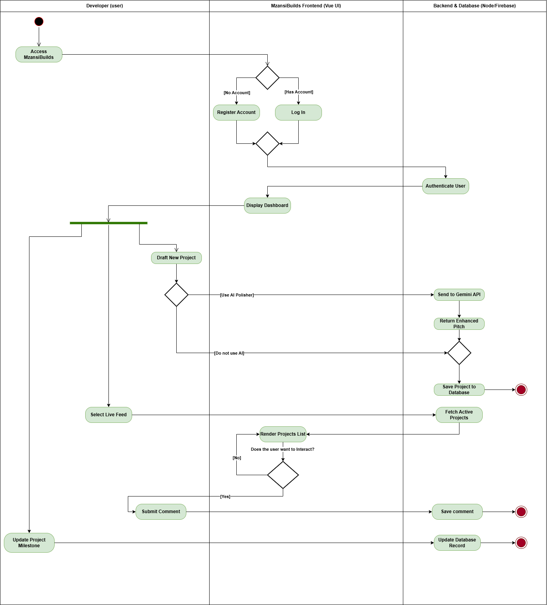

# MzansiBuilds

MzansiBuilds is a full-stack community platform designed for South African devs to pitch ideas, find their squad, log milestones, and ship proper code to the real world.

This project was built to satisfy the **Derivco** assessment requirements, focusing on developer interaction, project lifecycle management, and a solid, scalable architecture.

[](https://mzansibuilds.vercel.app/)
[](https://mzansibuilds-api.onrender.com)


## 🌟 Key Features

* **The Live Feed:** A dynamic, interactive feed where devs can view ongoing projects. Features reusable `ProjectCard` components.
* **Collaboration (Raise Hand):** Developers can toggle a "Raise Hand" feature to volunteer for specific roles (e.g., UI Design, Backend). Project owners have a dashboard to view the profiles of interested collaborators.
* **Project Lifecycle & Milestones:** Project owners can update the status of their builds (Idea → Prototyping → Development → Testing) and add public timeline milestones.
* **The Celebration Wall:** A dedicated showcase grid that only displays projects marked as `Completed`, fulfilling the ultimate platform goal.
* **Public Profiles:** Clicking any developer's avatar routes to a public profile showcasing their GitHub link, bio, and portfolio of created projects.
* **AI Pitch Polisher:** An integrated AI tool that takes a developer's rough idea and formats it into a professional, engaging project pitch.

## 🛠️ Tech Stack

### Frontend
* **Framework:** Vue 3 (Vite)
* **Styling:** Tailwind CSS (Custom Dark/Mzansi Green theme)
* **Routing:** Vue Router
* **UI/UX:** Custom HTML5 Canvas animations (Digital Point-Cloud Wave), Vue-Toastification for error handling.
* **Hosting:** Vercel

### Backend
* **Runtime:** Node.js / Express.js
* **Database:** Firebase Firestore (NoSQL)
* **Authentication:** Firebase Auth
* **AI Integration:** Google Gemini SDK & Groq SDK (Llama 3.1 8B) configured with a smart fallback wrapper for high availability.
* **Hosting:** Render

## 📂 Project Architecture

The repository is structured as a monolithic repository separating the client interface from the backend engine.

```text
mzansibuilds/
├── backend/
│   ├── package.json
│   ├── server.js               # Express server, API routes, and AI logic
│   └── firebaseServiceKey.json # (Ignored in Git) Firebase Admin credentials
│
├── frontend/
│   ├── index.html
│   ├── package.json
│   ├── vite.config.js
│   ├── vercel.json             # Vercel SPA routing rules
│   └── src/
│       ├── App.vue             # Global layout and Navbar
│       ├── components/         # Reusable UI architecture (ProjectCard, etc.)
│       └── views/              # Page-level components
````

## 📊 Activity Diagram

*The following diagram maps out the core user flow, from landing on the platform to raising a hand or shipping a project to the Celebration Wall. This was created before development began to guide my understanding and setup*



## 🤖 The Role of AI in this Project

Artificial Intelligence was utilised in two distinct ways during the lifecycle of this application:

1.  **AI-Assisted Development:** Google's Gemini was utilised as a productivity multiplier and pair-programming copilot. It was brilliant for speeding up boilerplate generation, brainstorming complex CSS keyframe animations, and rapidly debugging CORS issues and deployment configurations across Vercel and Render.
2.  **Native AI Features (Redundant Architecture):** The application features an AI Description Polisher. To ensure enterprise-grade reliability, the backend `server.js` implements a Smart AI Wrapper. It attempts to generate content using **Google Gemini** as the primary engine. If Gemini is unavailable, it seamlessly falls back to **Groq (Llama 3.1 8B)**, ensuring users never experience an AI outage.

## 🧠 Key Learnings

Building MzansiBuilds end-to-end provided an incredible environment to solidify my full-stack engineering skills:

  * **Component Architecture:** I vastly improved my understanding of separation of concerns in Vue 3. Moving from large, monolithic views to reusable components (like extracting the `ProjectCard`) taught me how to effectively manage state and pass data efficiently using `props`.
  * **Advanced JavaScript:** Handling complex asynchronous API calls deepened my foundational JavaScript skills.
  * **Automated Workflows:** Researching automated testing and CI/CD pipelines introduced me to GitHub Actions. Learning how modern teams automate their testing and deployment workflows was incredibly interesting and is a practice I plan to carry into future roles.

## 🗺️ Future Roadmap

If I had a bit more time, here are the immediate enhancements I would prioritise for the next iteration:

1.  **Security & Prompt Engineering:** Currently, the system prompt for the AI Description Polisher lives in the backend code. I would migrate these prompts into a secure database or Firebase Remote Config. This prevents hardcoding, adds a layer of security, and allows for prompt tweaking without requiring a server redeployment.
2.  **Iterative UI Refinement:** While the current UI is modern and responsive, I would love to spend more time refining micro-interactions and accessibility standards.
3.  **User Feedback Loops:** I would integrate an analytics tool or a native feedback form to gather actual usage data. Understanding how developers actually use the Feed versus how I intended them to use it would guide the next phase of feature development.

## 🚀 Running Locally

To run this project on your local machine, you will need two terminals running simultaneously.

### 1\. Start the Backend

Navigate to the `backend` folder, install dependencies, and start the server:

```bash
cd backend
npm install
npm start
```

*Note: You will need a `.env` file in the backend directory containing `FIREBASE_CREDENTIALS`, `GEMINI_API_KEY`, and `GROQ_API_KEY`.*

### 2\. Start the Frontend

In a new terminal, navigate to the `frontend` folder, install dependencies, and start the Vite development server:

```bash
cd frontend
npm install
npm run dev
```

*Note: You will need a `.env` file in the frontend directory containing your standard `VITE_FIREBASE_*` configuration keys.*

```
```
